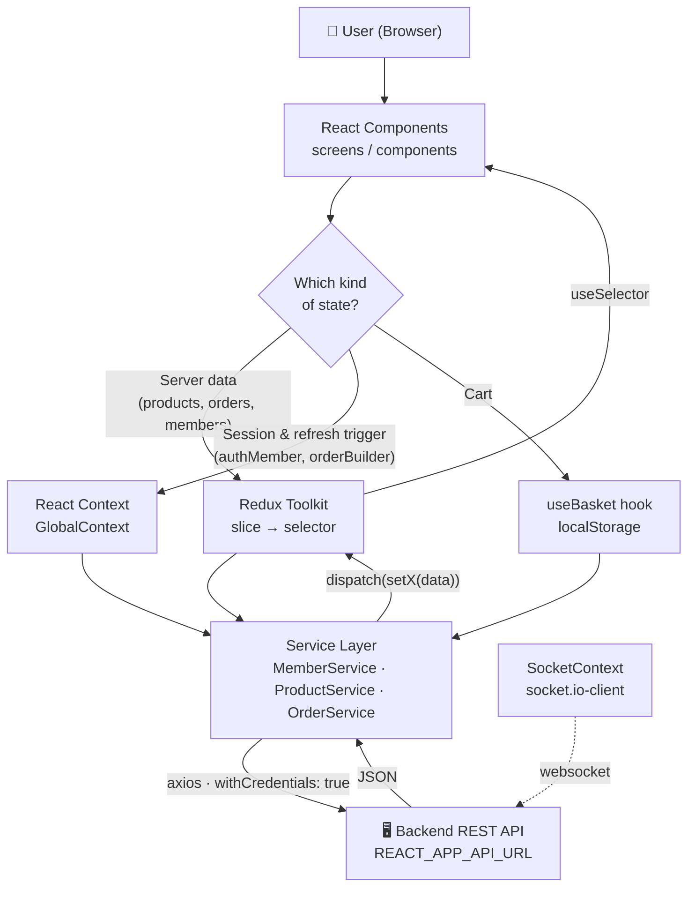
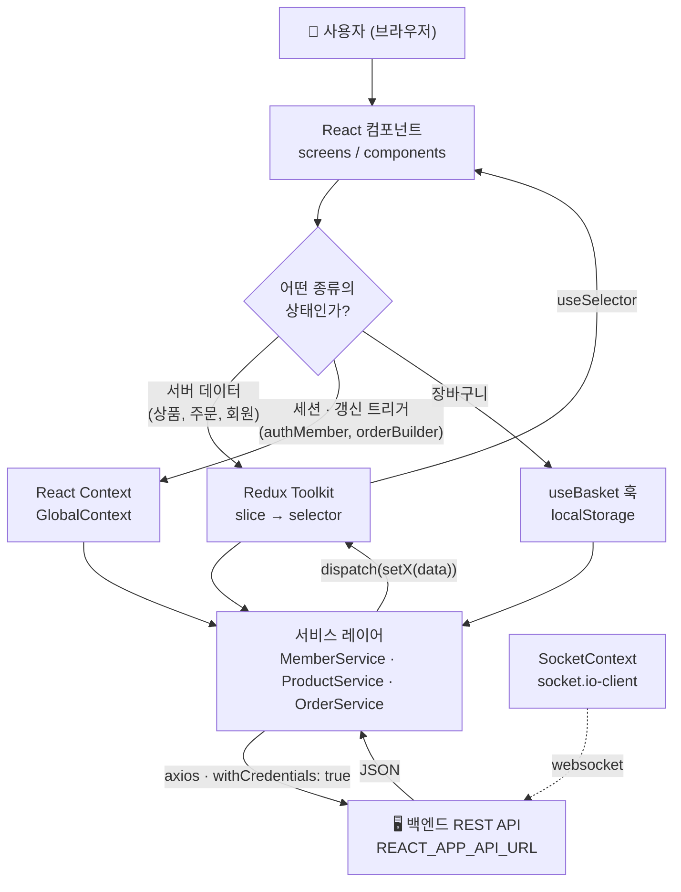

<div align="center">


# 🍦 Icefy — Ice Cream E-Commerce Frontend

**A production-deployed React + TypeScript single-page application for an ice cream shop:
catalog browsing, search & filtering, likes, a persistent cart, and a full order lifecycle.**

[](https://react.dev/)
[](https://www.typescriptlang.org/)
[](https://redux-toolkit.js.org/)
[](https://mui.com/)
[](https://reactrouter.com/)
[](https://socket.io/)
[](https://pm2.keymetrics.io/)

**🌐 [English](#-english) · [한국어](#-한국어)**

</div>

---

<a name="-english"></a>

# 🇬🇧 English

## Table of Contents

1. [Overview](#1-overview)
2. [Screenshots](#2-screenshots)
3. [Tech Stack](#3-tech-stack)
4. [Features](#4-features)
5. [Architecture](#5-architecture)
6. [Project Structure](#6-project-structure)
7. [State Management](#7-state-management)
8. [Routing](#8-routing)
9. [API Layer](#9-api-layer)
10. [Domain Model](#10-domain-model)
11. [Authentication Flow](#11-authentication-flow)
12. [Cart & Order Lifecycle](#12-cart--order-lifecycle)
13. [Real-Time Layer](#13-real-time-layer)
14. [Getting Started](#14-getting-started)
15. [Available Scripts](#15-available-scripts)
16. [Deployment](#16-deployment)
17. [Code Conventions](#17-code-conventions)
18. [Known Limitations & Roadmap](#18-known-limitations--roadmap)
19. [Author](#19-author)

---

## 1. Overview

**Icefy** is the **frontend** of an ice cream e-commerce platform. It is a client-side rendered
single-page application built with **React 18 + TypeScript**, talking to a **separate backend REST API**
over Axios with cookie-based sessions.

### What this repository contains

| ✅ Included | ❌ Not included |
| :--- | :--- |
| All UI screens and components | Backend server source code |
| Redux Toolkit store, slices, selectors | Database (MongoDB) |
| API service layer (Axios classes) | Image/video upload storage |
| Auth session handling (Context + cookies) | Admin dashboard |
| Cart logic with localStorage persistence | |
| Socket.IO client connection layer | |
| Production build & PM2 deployment script | |

### How it connects to the backend

The frontend is **stateless with respect to the server**: every piece of business data
(products, members, orders, likes) is fetched from the backend at runtime through a
single configurable base URL, `REACT_APP_API_URL`.

```
┌────────────────────┐   REST (axios, withCredentials)   ┌────────────────────┐
│   Icefy Frontend   │ ───────────────────────────────▶  │   Backend REST API │
│   (this repo)      │ ◀───────────────────────────────  │   + static uploads │
│   React SPA :3000  │   JSON + httpOnly session cookie  │   + Socket.IO :4003│
└────────────────────┘                                    └────────────────────┘
```

The backend is expected to serve three things on the same origin:

1. **REST endpoints** — `/member/*`, `/product/*`, `/order/*`
2. **Static files** — uploaded product/member images are referenced as `` `${serverApi}/${imagePath}` ``
3. **A Socket.IO endpoint** — for the real-time layer

---

## 2. Screenshots

> Place your captures in `docs/screenshots/` and uncomment the block below.

<!--
| Home | Products |
| :---: | :---: |
|  |  |

| Product Detail | Orders |
| :---: | :---: |
|  |  |
-->

---

## 3. Tech Stack

| Layer | Technology | Why it was chosen |
| :--- | :--- | :--- |
| **Framework** | React 18.2 | Concurrent rendering, `createRoot`, mature ecosystem |
| **Language** | TypeScript 5.9 (`strict: true`) | Compile-time safety across the API boundary |
| **Build tool** | Create React App (`react-scripts` 5) | Zero-config toolchain, stable for this scope |
| **Routing** | React Router 7.13 | Nested routes for the product detail page |
| **Server state** | Redux Toolkit 1.8 + React Redux 8 | One predictable store per page, memoized selectors |
| **Dev tooling** | `redux-logger` | Every action/state transition visible in the console |
| **Session state** | React Context API | Auth member + global refresh trigger, no store bloat |
| **Cart state** | Custom hook + `localStorage` | Survives reloads without a backend round-trip |
| **UI library** | MUI 7 (Material, Lab, Joy, Icons) | Accessible primitives + a custom theme |
| **Styling** | Emotion, styled-components, 19 modular CSS files | Component-scoped styling where it matters |
| **HTTP** | Axios 0.27 | Interceptable, `withCredentials` for cookie auth |
| **Real-time** | `socket.io-client` 4.7 | Bidirectional channel to the API server |
| **Feedback** | SweetAlert2 | Consistent success/error dialogs and toasts |
| **Carousels** | Swiper 12 | Testimonials and image galleries |
| **Utilities** | Moment.js, `universal-cookie` | Date formatting, cookie reads |
| **Runtime/Deploy** | Node 20, Yarn, `serve`, PM2 | Static build served under a process manager |

---

## 4. Features

### 🏠 Home Page (`/`)

- **Video hero header** with a transparent navbar that turns solid on scroll (`window.scrollY > 50`)
- **Classic Favorites** — top 4 products ordered by `productLikes`, fetched on mount
- **Special Discount** promotional banner
- **Best Sellers** — top 4 products ordered by `productViews`
- **Top Members** — most active users from `/member/top-users`
- **Testimonials** — Swiper carousel with autoplay, pagination and star ratings
- **Instagram gallery** grid

### 🍨 Products Page (`/products`)

- **Full-text search** by product name (fires on button click or `Enter`)
- **Sorting** — 4 modes: newest (`createdAt`), price, likes, views
- **Category filter** — `CLASSIC` · `PREMIUM` · `LIMITED` · `KIDS` · `OTHER`
- **Flavor filter** — 10 flavors (Vanilla, Chocolate, Strawberry, Cookies & Cream, Mango, Matcha, Mint Choc Chip, Coffee, Caramel, Yogurt)
- **Pagination** with custom MUI arrow icons
- **Product cards** with like toggle, view counter, rating and add-to-cart
- Empty state illustration when no product matches

### 🔍 Product Detail (`/products/:productId`)

- **Thumbnail gallery** — click any thumbnail to switch the main image
- **Optimistic like toggle** — the counter increments/decrements from the API's `action: "created" | "deleted"` response before a refetch
- **Quantity selector** and add-to-cart
- **Seller info** loaded from `/member/getAdmin`
- Login is enforced before liking

### 🧾 Orders Page (`/orders`) — auth required

Three MUI tabs mapped 1:1 to the backend order statuses:

| Tab | Status | Available actions |
| :--- | :--- | :--- |
| **Paused Orders** | `PAUSE` | `Cancel` → `DELETE`, `Payment` → `PROCESS` |
| **Process Orders** | `PROCESS` | `Finish` → `FINISH` |
| **Finished Orders** | `FINISH` | Read-only history |

- Per-order breakdown: item price × quantity, delivery cost, total
- Sidebar with the member profile card and a mock payment card panel
- `window.confirm` guards before every destructive/irreversible transition

### 👤 User Page (`/user-page`) — auth required

- **Modify Member Details** — nickname, phone, address, description
- **Avatar upload** with client-side MIME validation (`jpg`/`jpeg`/`png` only) and instant preview via `URL.createObjectURL`
- **Liked Products** tab — paginated grid of the member's liked items with unlike + add-to-cart
- Profile sidebar with member type badge (`USER` / `ADMIN`) and social links

### 🛒 Cart (in every navbar)

- Badge showing the live item count
- Increment / decrement / remove single / clear all
- **Automatic shipping rule**: `$5` under `$100`, free at `$100` and above
- `Order` submits the whole cart in one request and redirects to `/orders`

### 🔐 Authentication

- Signup / Login inside a single animated modal (video background, floating ice-cream decorations)
- `Enter` key submits the form
- Logout via an avatar dropdown menu with a success toast

### 📄 Content pages

- **About Us** (`/about`) — intro, moments, statistics, team members, address
- **Blog** (`/blog-page`) — expandable MUI cards
- **Help** (`/help-page`) — FAQ accordion + contact tab

---

## 5. Architecture

### Data flow



### Provider composition (`src/index.tsx`)

Providers are nested in a deliberate order — the store is outermost so that both the
auth context and the theme can be consumed by anything below them:

```tsx
<React.StrictMode>
  <Provider store={store}>            {/* 1. Redux store        */}
    <ContextProvider>                 {/* 2. Auth + refresh ctx  */}
      <SocketProvider>                {/* 3. Socket.IO instance  */}
        <ThemeProvider theme={theme}> {/* 4. MUI custom theme    */}
          <CssBaseline />
          <BrowserRouter>             {/* 5. Routing             */}
            <App />
          </BrowserRouter>
        </ThemeProvider>
      </SocketProvider>
    </ContextProvider>
  </Provider>
</React.StrictMode>
```

### The per-page module pattern

Every data-driven screen is a **self-contained module** — its own slice, its own selectors,
its own subcomponents. Adding a new page never requires touching another page's code:

```
screens/ordersPage/
├── index.tsx            # container: fetches data, dispatches to the store
├── slice.ts             # createSlice — reducers + actions
├── selector.ts          # createSelector — memoized reads
├── PausedOrders.tsx     # presentational tab
├── ProcessOrders.tsx
└── FinishedOrders.tsx
```

---

## 6. Project Structure

```
icefy-react/
├── public/                          # Static assets served as-is
│   ├── icons/                       # SVG/PNG icons, payment cards, favicon
│   ├── img/                         # Photos: blog, team, instagram, banners
│   ├── video/                       # Hero & auth-modal background videos
│   └── index.html                   # HTML shell (#root)
│
├── src/
│   ├── index.tsx                    # Entry point — provider composition
│   ├── css/                         # 19 page/section-scoped stylesheets
│   │
│   ├── app/
│   │   ├── App.tsx                  # Route table + navbar switching + auth modal
│   │   ├── store.ts                 # configureStore, RootState, AppDispatch
│   │   ├── hooks.ts                 # Typed useAppDispatch / useAppSelector
│   │   │
│   │   ├── MaterialTheme/           # MUI theme
│   │   │   ├── index.ts             #   palette, component overrides, breakpoints
│   │   │   ├── typography.ts        #   h1–h6 scale
│   │   │   └── shadow.ts            #   elevation presets
│   │   │
│   │   ├── context/
│   │   │   ├── ContextProvider.tsx  # authMember + orderBuilder provider
│   │   │   └── SocketContext.tsx    # Socket.IO singleton provider
│   │   │
│   │   ├── hooks/
│   │   │   ├── useGlobals.ts        # Typed context consumer (throws if unwrapped)
│   │   │   └── useBasket.ts         # Cart CRUD + localStorage sync
│   │   │
│   │   ├── services/                # ── API LAYER ──
│   │   │   ├── MemberService.ts     #   auth, profile, top members
│   │   │   ├── ProductService.ts    #   catalog, likes, detail
│   │   │   └── OrderService.ts      #   create / list / update orders
│   │   │
│   │   ├── screens/                 # ── PAGES ──
│   │   │   ├── homePage/            #   + slice + selector + 7 sections
│   │   │   ├── productsPage/        #   + slice + selector + detail view
│   │   │   ├── ordersPage/          #   + slice + selector + 3 tabs
│   │   │   ├── userPage/            #   + slice + selector + settings
│   │   │   ├── aboutUsPage/         #   5 static sections
│   │   │   ├── blogPage/
│   │   │   └── helpPage/
│   │   │
│   │   └── components/              # ── SHARED UI ──
│   │       ├── headers/             #   7 route-specific navbars + Basket
│   │       ├── cards/               #   Products, BestSellers, Favorites, Liked
│   │       ├── auth/                #   Signup + Login modal
│   │       └── footer/
│   │
│   └── lib/                         # ── FRAMEWORK-FREE CORE ──
│       ├── config.ts                #   serverApi + user-facing messages
│       ├── sweetAlert.ts            #   4 reusable alert helpers
│       ├── types/                   #   member, product, order, screen, search
│       ├── enums/                   #   member, product, order, like, view
│       └── data/faq.ts              #   Static FAQ content
│
├── deploy.sh                        # Production deploy (git → build → PM2)
├── tsconfig.json                    # strict mode enabled
└── package.json
```

---

## 7. State Management

The app deliberately uses **three different state mechanisms**, each for the job it fits best.
This separation is the core architectural decision of the project.

| # | Mechanism | Holds | Lifetime | Where |
| :-: | :--- | :--- | :--- | :--- |
| 1 | **Redux Toolkit** | Server data: products, orders, members, liked items | Per session, reset on reload | `screens/*/slice.ts` |
| 2 | **React Context** | `authMember`, `orderBuilder` refresh trigger | Per session, rehydrated from `localStorage` | `context/ContextProvider.tsx` |
| 3 | **localStorage hook** | Shopping cart (`cartData`) | Persists across reloads and tabs | `hooks/useBasket.ts` |

### 7.1 Redux — four page-scoped slices

```ts
// src/app/store.ts
export const store = configureStore({
  middleware: (getDefaultMiddleware) => getDefaultMiddleware().concat(reduxLogger),
  reducer: {
    homePage:     HomePageReducer,
    productsPage: ProductsPageReducer,
    ordersPage:   OrdersPageReducer,
    userPage:     UserPageReducer,
  },
});
```

| Slice | State shape | Actions |
| :--- | :--- | :--- |
| `homePage` | `classicFavorites`, `bestSellers`, `topMembers` | `setClassicFavorites`, `setBestSellers`, `setTopMembers` |
| `productsPage` | `products`, `chosenProduct`, `restaurant` | `setProducts`, `setChosenProduct`, `setRestaurant` |
| `ordersPage` | `pausedOrders`, `processOrders`, `finishedOrders` | `setPausedOrders`, `setProcessOrders`, `setFinishedOrders` |
| `userPage` | `likedProducts` | `setLikedProducts` |

Reads always go through **memoized selectors** (`createSelector`), so a component only
re-renders when the exact branch it subscribes to actually changes:

```ts
// src/app/screens/homePage/selector.ts
const selectHomePage = (state: AppRootState) => state.homePage;

export const retrieveBestSellers = createSelector(
  selectHomePage,
  (HomePage) => HomePage.bestSellers,
);
```

Dispatches are grouped in a small `actionDispatch` factory and wrapped in `useMemo`,
which keeps the `useEffect` dependency array stable and prevents fetch loops:

```tsx
const actionDispatch = (dispatch: Dispatch) => ({
  setBestSellers: (data: Product[]) => dispatch(setBestSellers(data)),
});

const { setBestSellers } = useMemo(() => actionDispatch(dispatch), [dispatch]);
```

### 7.2 Context — session & cross-page refresh

```ts
interface GlobalInterface {
  authMember:     Member | null;          // currently logged-in user
  setAuthMember:  (member: Member | null) => void;
  orderBuilder:   Date;                   // refresh trigger
  setOrderBuilder: (input: Date) => void;
}
```

`orderBuilder` is a lightweight **cross-component invalidation signal**. When an order is
created in the cart or its status changes in a tab, the mutating component calls
`setOrderBuilder(new Date())`; the Orders page lists `orderBuilder` in its `useEffect`
dependencies and refetches automatically — no prop drilling, no event bus.

`useGlobals()` throws when used outside the provider, so misuse fails loudly at development time:

```ts
export const useGlobals = () => {
  const context = useContext(GlobalContext);
  if (context === undefined) throw new Error("useGlobals within Provider");
  return context;
};
```

### 7.3 localStorage — the cart

`useBasket` exposes `cartItems`, `onAdd`, `onRemove`, `onDelete`, `onDeleteAll`. Every
mutation writes React state **and** `localStorage` in the same step, so the cart survives a
refresh. `onAdd` merges duplicates by `_id` and increments quantity instead of appending.

---

## 8. Routing

Routes are declared in [`src/app/App.tsx`](src/app/App.tsx):

| Path | Component | Navbar | Auth |
| :--- | :--- | :--- | :---: |
| `/` | `HomePage` | `HomeNavbar` (video hero) | — |
| `/about` | `AboutUsPage` | `AboutUsNavbar` | — |
| `/products` | `Products` | `ProductsNavbar` | — |
| `/products/:productId` | `ChosenProduct` | `ChosenProductNavbar` | — |
| `/orders` | `OrdersPage` | `OrdersNavbar` | ✅ |
| `/user-page` | `UsersPage` | `UserNavbar` | ✅ |
| `/blog-page` | `BlogPage` | `BlogNavbar` | — |
| `/help-page` | `HelpPage` | `HelpNavbar` | — |

**Nested routing** — the products area owns its own `<Routes>` block, so the list and the
detail view share one parent route (`/products/*`):

```tsx
<Routes>
  <Route index element={<Products onAdd={onAdd} />} />
  <Route path=":productId" element={<ChosenProduct ... />} />
</Routes>
```

**Per-route navbars** — each page has a visually distinct header, resolved from
`useLocation().pathname` in `App.tsx`. Protected pages call `navigate("/")` when
`authMember` is `null`.

---

## 9. API Layer

All network access is isolated in **three service classes**. No component ever calls `axios`
directly — swapping the transport would touch only these files.

```ts
class ProductService {
  private readonly path: string;
  constructor() { this.path = serverApi; }   // serverApi = process.env.REACT_APP_API_URL
  // ...
}
```

Every authenticated request passes `withCredentials: true`, so the browser attaches the
httpOnly session cookie issued by the backend.

### `MemberService` — [`src/app/services/MemberService.ts`](src/app/services/MemberService.ts)

| Method | Endpoint | Purpose |
| :--- | :--- | :--- |
| `signup(input)` | `POST /member/signup` | Register, then cache the member locally |
| `login(input)` | `POST /member/login` | Authenticate, then cache the member locally |
| `logout()` | `POST /member/logout` | Clear the server session + `memberData` |
| `updateMember(input)` | `POST /member/updateMember` | Update the profile (`multipart/form-data` for the avatar) |
| `getTopMembers()` | `GET /member/top-users` | Home page "Top Members" section |
| `getAdmin()` | `GET /member/getAdmin` | Seller info on the product detail page |

### `ProductService` — [`src/app/services/ProductService.ts`](src/app/services/ProductService.ts)

| Method | Endpoint | Purpose |
| :--- | :--- | :--- |
| `getProducts(inquery)` | `GET /product/all?order=&page=&limit=&productCategory=&productFlavor=&search=` | Catalog with sorting, filtering, pagination, search |
| `getProduct(id)` | `GET /product/:productId` | Product detail (also increments views server-side) |
| `likeToggle(id)` | `POST /product/like/:id` | Toggle like; responds with `action: "created" \| "deleted"` |
| `getLikedProducts(input)` | `GET /product/likedProducts?page=&limit=` | The member's liked items |

### `OrderService` — [`src/app/services/OrderService.ts`](src/app/services/OrderService.ts)

| Method | Endpoint | Purpose |
| :--- | :--- | :--- |
| `createOrder(cartItems)` | `POST /order/create` | Maps `CartItem[]` → `OrderItemInput[]` and submits |
| `getMyOrders(inquery)` | `GET /order/all?page=&limit=&orderStatus=` | Orders filtered by status |
| `updateOrder(input)` | `POST /order/update` | Move an order to the next status |

---

## 10. Domain Model

TypeScript interfaces mirror the backend schema exactly, so a response shape change surfaces
as a compile error rather than a runtime crash.

### Core entities — [`src/lib/types/`](src/lib/types/)

```ts
interface Member {
  _id: string;
  memberType: MemberType;        // USER | ADMIN
  memberStatus: MemberStatus;    // ACTIVE | BLOCK | DELETE
  memberNick: string;
  memberPhone: string;
  memberAddress?: string;
  memberDesc?: string;
  memberImage?: string;
  memberPoints: number;
  createdAt: Date;
  updatedAt: Date;
}

interface Product {
  _id: string;
  productStatus: ProductStatus;      // PAUSE | PROCESS | DELETE
  productCategory: ProductCategory;  // CLASSIC | PREMIUM | LIMITED | KIDS | OTHER
  productFlavor: ProductFlavor;      // VANILLA | CHOCOLATE | ... (10 flavors)
  productName: string;
  productPrice: number;
  productLeftCount: number;
  productSize: ProductSize;          // SMALL | MEDIUM | LARGE
  productVolume: number;
  productImages: string[];
  productLikes?: number;
  productViews: number;
  isLiked: boolean;                  // computed per requesting member
  createdAt: Date;
  updatedAt: Date;
}

interface Order {
  _id: string;
  orderTotal: number;
  orderDelivery: number;
  orderStatus: OrderStatus;          // PAUSE | PROCESS | FINISH | DELETE
  memberId: string;
  orderItems: OrderItem[];           // from backend aggregation
  productData: Product[];            // from backend aggregation
  createdAt: Date;
  updatedAt: Date;
}
```

### Enums — [`src/lib/enums/`](src/lib/enums/)

| File | Enums |
| :--- | :--- |
| `member.enum.ts` | `MemberType`, `MemberStatus` |
| `product.enum.ts` | `ProductCategory`, `ProductFlavor`, `ProductSize`, `ProductStatus` |
| `order.enum.ts` | `OrderStatus` |
| `like.enum.ts` / `view.enum.ts` | `LikeGroup`, `ViewGroup` |

### Store typing — [`src/lib/types/screen.ts`](src/lib/types/screen.ts)

`AppRootState` describes the full Redux tree, which makes every `createSelector` fully typed
end to end.

---

## 11. Authentication Flow

Sessions are **cookie-based**, with a locally cached profile for instant first paint.

```
SIGNUP / LOGIN
   │
   ├─▶ POST /member/signup | /member/login   (withCredentials: true)
   │       └─▶ backend sets an httpOnly `accessToken` cookie
   │
   ├─▶ localStorage.setItem("memberData", JSON.stringify(member))
   └─▶ setAuthMember(member)   →  every navbar re-renders as "logged in"

PAGE RELOAD
   │
   ├─▶ ContextProvider reads the `accessToken` cookie via universal-cookie
   ├─▶ cookie missing?  →  localStorage.removeItem("memberData")   (stale profile purged)
   └─▶ cookie present?  →  authMember rehydrated from localStorage — no loading flash

LOGOUT
   │
   ├─▶ POST /member/logout  →  backend clears the cookie
   ├─▶ localStorage.removeItem("memberData")
   └─▶ setAuthMember(null)  →  success toast
```

**Why both a cookie and localStorage?** The cookie is the actual credential — it is httpOnly,
so JavaScript can never read the token, which rules out token theft via XSS. `localStorage`
only caches *display* data (nickname, avatar, member type) so the UI can render the logged-in
state instantly on reload without waiting for a `/me` round-trip. The cookie is always the
source of truth: if it is gone, the cached profile is discarded on the next boot.

Protected pages (`/orders`, `/user-page`) redirect to `/` when `authMember` is `null`, and
mutating actions throw `Messages.error2` ("Please login first!") through the shared
SweetAlert2 handler.

---

## 12. Cart & Order Lifecycle

### Client-side cart

```ts
const itemsPrice    = cartItems.reduce((a, c) => a + c.quantity * (c.price ?? 0), 0);
const shippingCost  = itemsPrice < 100 ? 5 : 0;   // free shipping from $100
const totalPrice    = (itemsPrice + shippingCost).toFixed(1);
```

### Order state machine

```
   🛒 Cart (localStorage)
          │  POST /order/create
          ▼
      ┌────────┐  Payment   ┌──────────┐  Finish   ┌────────┐
      │ PAUSE  │ ─────────▶ │ PROCESS  │ ────────▶ │ FINISH │
      └────────┘            └──────────┘           └────────┘
          │ Cancel
          ▼
      ┌────────┐
      │ DELETE │
      └────────┘
```

Each transition is a `POST /order/update` with `{ orderId, orderStatus }`, guarded by a
`window.confirm`, and followed by `setOrderBuilder(new Date())` to trigger a refetch of all
three tabs at once.

---

## 13. Real-Time Layer

A single **Socket.IO client instance** is created once at module scope and shared through
React Context, so hot reloads and re-renders never open duplicate connections:

```tsx
// src/app/context/SocketContext.tsx
const socket = io(process.env.REACT_APP_API_URL as string, {
  withCredentials: true,   // the session cookie authenticates the socket too
});

export const SocketContext = createContext<Socket>(socket);
```

> **Current status:** the connection layer is complete and mounted in the provider tree
> (`SocketProvider` wraps the whole app), and it authenticates using the same session cookie
> as the REST calls. No UI component subscribes to events yet — the live-chat and order-status
> notification features that will consume it are on the roadmap ([§18](#18-known-limitations--roadmap)).

---

## 14. Getting Started

### Prerequisites

| Requirement | Version used |
| :--- | :--- |
| Node.js | 20.x (verified on 20.19.5) |
| Yarn | 1.x (npm also works) |
| Backend API | Running and reachable — this frontend has no mock layer |

### 1. Clone and install

```bash
git clone https://github.com/NBekhruzbek/icefy-react.git
cd icefy-react
yarn install          # or: npm install
```

### 2. Configure the environment

Create a `.env` file in the project root (it is git-ignored):

```env
REACT_APP_API_URL=http://localhost:4003
```

> ⚠️ CRA only exposes variables prefixed with `REACT_APP_`, and they are **inlined at build
> time** — after changing `.env` you must restart the dev server or rebuild.

### 3. Run

```bash
yarn start
```

The app opens at **http://localhost:3000** with hot reload.

### 4. Verify the setup

- The home page shows real products → REST is reachable
- The browser console prints Redux actions → the store is wired
- Signup/Login succeeds and the navbar shows your avatar → cookies pass through (make sure
  the backend CORS config allows this origin **with credentials**)

---

## 15. Available Scripts

| Command | What it does |
| :--- | :--- |
| `yarn start` | Dev server on port `3000` with hot reload and error overlay |
| `yarn build` | Minified, hashed production bundle into `build/` |
| `yarn start:prod` | Serves `build/` statically on port `4100` via `serve` |
| `yarn test` | Jest + React Testing Library in watch mode |
| `yarn eject` | ⚠️ One-way CRA config ejection — not used in this project |

---

## 16. Deployment

Icefy ships as a **static bundle**. `yarn build` compiles React into hashed files under `build/`,
[`serve`](https://www.npmjs.com/package/serve) hands those files out over HTTP on port `4100`, and
**PM2** keeps that process alive and brings it back after a reboot. The app has no Node server of
its own — every dynamic piece comes from the backend API, which the browser calls **directly**.

### 16.1 Production topology

```
                     ┌───────────────────────────────────────────┐
   Browser ──:443──▶ │  Nginx — TLS termination, custom domain   │
                     │  proxy_pass → http://127.0.0.1:4100       │
                     └────────────────────┬──────────────────────┘
                                          │
                     ┌────────────────────▼──────────────────────┐
                     │  PM2 › ICEFY-REACT                        │
                     │  serve -s build -l 4100   (static SPA)    │
                     └───────────────────────────────────────────┘

   Browser ─── REST over axios (withCredentials) ──────▶  Backend API :4003
   Browser ─── WebSocket via Socket.IO           ──────▶  Backend API :4003
```

The important consequence: **Nginx only serves the SPA shell**. REST and Socket.IO traffic leaves
the browser for the backend origin directly, so the backend — not this repo — owns CORS, cookies
and TLS for the API.

### 16.2 Server prerequisites

| Requirement | Notes |
| :--- | :--- |
| Node.js 20.x | Same major as development (verified on 20.19.5) |
| Yarn 1.x | Installed globally by `deploy.sh`; npm works too |
| PM2 | Process supervisor — install once, globally |
| `serve` | Static file server with SPA fallback — installed globally by `deploy.sh` |
| Git | `deploy.sh` pulls the release from `origin/main` |
| Port `4100` | Local only; expose `80`/`443` through Nginx instead |
| Reachable backend | The API host must accept requests from the deployed origin |
| ~1 GB free RAM | CRA's production build is memory-hungry on small VPS instances |

### 16.3 First deploy on a fresh server

```bash
# 1 — toolchain
curl -fsSL https://deb.nodesource.com/setup_20.x | sudo -E bash -
sudo apt-get install -y nodejs git
sudo npm i -g yarn pm2 serve

# 2 — code
git clone https://github.com/NBekhruzbek/icefy-react.git
cd icefy-react

# 3 — environment  (MUST exist before the build)
printf 'REACT_APP_API_URL=https://api.your-domain.com\n' > .env

# 4 — build and start
chmod +x deploy.sh
./deploy.sh

# 5 — survive reboots (once per server)
pm2 startup && pm2 save
```

> ⚠️ `.env` is git-ignored. That is why `git reset --hard` inside `deploy.sh` never wipes it — but
> it also means git will **never** deliver it. On a new server you write the file by hand, *before*
> step 4, or the bundle is built with `REACT_APP_API_URL` undefined and every request goes to
> `undefined/member/login`.

### 16.4 One-command deploy — [`deploy.sh`](deploy.sh)

```bash
#!/bin/bash
# PRODUCTION
git reset --hard          # discard any drift on the server
git checkout main
git pull origin main      # fetch the latest release

npm i yarn -g             # ensure the toolchain
yarn global add serve
yarn                      # install dependencies
yarn run build            # compile the production bundle

pm2 start "yarn run start:prod" --name=ICEFY-REACT
```

| Line | Why it is there |
| :--- | :--- |
| `git reset --hard` | Guarantees a clean tree so `git pull` can never hit a merge conflict on the server |
| `git checkout main` | `main` is the release branch; day-to-day work happens on `develop` |
| `yarn global add serve` | `start:prod` calls `serve`, which is not a project dependency |
| `yarn run build` | Produces `build/` — git-ignored, so the bundle is always built on the server |
| `pm2 start …` | Registers the process under the name `ICEFY-REACT` for later `logs` / `restart` |

Run it with:

```bash
chmod +x deploy.sh
./deploy.sh
```

### 16.5 Redeploying a new release

The script ends with `pm2 start`, which **fails on the second run** — PM2 refuses to launch a
script already registered under that name. For subsequent releases:

```bash
cd ~/icefy-react
./deploy.sh                 # the final pm2 start errors out; the build already succeeded
pm2 restart ICEFY-REACT     # pick up the fresh bundle
```

`serve` reads files from disk on every request, so a finished build is live even before the
restart; restarting is still the safest habit, and is required if `package.json` scripts changed.

To make the script idempotent, replace its last line with:

```bash
pm2 restart ICEFY-REACT --update-env || pm2 start "yarn run start:prod" --name=ICEFY-REACT
```

### 16.6 Operating the process

| Command | What it does |
| :--- | :--- |
| `pm2 list` | Status, uptime and restart count of every process |
| `pm2 logs ICEFY-REACT` | Tail stdout/stderr live |
| `pm2 logs ICEFY-REACT --lines 200` | Last 200 log lines |
| `pm2 restart ICEFY-REACT` | Restart after a redeploy |
| `pm2 stop ICEFY-REACT` | Take the site offline without unregistering it |
| `pm2 delete ICEFY-REACT` | Unregister — needed before a clean `pm2 start` |
| `pm2 monit` | Live CPU / memory dashboard |
| `pm2 flush` | Truncate log files that have grown large |
| `pm2 startup && pm2 save` | Persist the process list so it returns after a reboot |

### 16.7 Nginx reverse proxy and TLS

Put Nginx in front of port `4100` to get a domain, HTTPS and gzip:

```nginx
server {
    listen 80;
    server_name icefy.your-domain.com;
    return 301 https://$host$request_uri;
}

server {
    listen 443 ssl;
    http2 on;
    server_name icefy.your-domain.com;

    ssl_certificate     /etc/letsencrypt/live/icefy.your-domain.com/fullchain.pem;
    ssl_certificate_key /etc/letsencrypt/live/icefy.your-domain.com/privkey.pem;

    location / {
        proxy_pass         http://127.0.0.1:4100;
        proxy_http_version 1.1;
        proxy_set_header   Host              $host;
        proxy_set_header   X-Real-IP         $remote_addr;
        proxy_set_header   X-Forwarded-For   $proxy_add_x_forwarded_for;
        proxy_set_header   X-Forwarded-Proto $scheme;
    }

    # hashed assets are immutable; index.html must never be cached
    location = /index.html {
        proxy_pass http://127.0.0.1:4100;
        add_header Cache-Control "no-store";
    }
}
```

```bash
sudo certbot --nginx -d icefy.your-domain.com   # issue + auto-renew the certificate
sudo nginx -t && sudo systemctl reload nginx
```

Do **not** replace the proxy with a plain `root /path/build;` block unless you also add
`try_files $uri /index.html;` — that fallback is what `serve -s` provides, and without it a hard
refresh on `/products/123` returns 404.

### 16.8 Environment variables are baked into the bundle

This is the single most common deployment surprise with CRA:

- `REACT_APP_API_URL` is **inlined at build time**, not read at runtime. Changing `.env` and
  restarting PM2 changes nothing — you must `yarn run build` again. Verify with
  `grep -ro "4003" build/static/js | head -1`.
- Only variables prefixed `REACT_APP_` are exposed, and **everything inlined is public** — it ships
  inside the JavaScript. Never put a secret in `.env`.
- Once the SPA is served over HTTPS, the API must be HTTPS too. A `https://` page calling
  `http://…:4003` is blocked as mixed content, which kills both axios and the Socket.IO connection
  in [`SocketContext.tsx`](src/app/context/SocketContext.tsx).
- Every service call sets `withCredentials: true`, so the backend must answer with
  `Access-Control-Allow-Origin: <exact deployed origin>` and `Access-Control-Allow-Credentials: true`.
  A wildcard `*` is rejected by the browser when credentials are involved. Cross-site session
  cookies additionally need `SameSite=None; Secure`.

### 16.9 Rolling back

```bash
cd ~/icefy-react
git log --oneline -10
git checkout <last-good-commit>
yarn && yarn run build
pm2 restart ICEFY-REACT
```

The next `./deploy.sh` run resets to the tip of `main`, so a rollback lasts only until the
following deploy — fix forward, or move `main` back, to make it permanent.

### 16.10 Troubleshooting

| Symptom | Likely cause | Fix |
| :--- | :--- | :--- |
| Blank white page, 404s for `/static/js/*` | App served from a sub-path | Serve from the domain root, or set `"homepage"` in `package.json` and rebuild |
| `/products/123` 404s on refresh | SPA fallback lost (`-s` flag dropped, or Nginx serving files directly) | Keep `serve -s build`; proxy to it instead of using `root` |
| Requests go to `undefined/...` | `.env` missing at build time | Create `.env`, then **rebuild** |
| Console shows a CORS error | Deployed origin not allow-listed by the API | Add the origin on the backend with credentials enabled |
| `Mixed Content: blocked` | HTTPS page, HTTP API | Serve the API over HTTPS and rebuild |
| Login works, session lost on refresh | Cross-site cookie rejected | Backend cookie needs `SameSite=None; Secure` |
| `EADDRINUSE :4100` | An old `serve` is still running | `pm2 delete ICEFY-REACT`, then check `lsof -i :4100` |
| `Script already launched` from PM2 | Second `./deploy.sh` run | `pm2 restart ICEFY-REACT`, or use the idempotent line in §16.5 |
| Site gone after a reboot | Process list never persisted | `pm2 startup && pm2 save` |
| Old UI after a deploy | Cached `index.html` | Hard refresh; add the `no-store` header from §16.7 |
| Build killed on a small VPS | Out of memory | Add swap, or build elsewhere and copy `build/` over |

### 16.11 Release checklist

- [ ] `.env` on the server points at the **production** API over HTTPS
- [ ] `yarn run build` completes with no TypeScript errors
- [ ] `pm2 list` shows `ICEFY-REACT` **online** with a stable restart count
- [ ] `pm2 startup && pm2 save` has been run once on this server
- [ ] Backend CORS allows the deployed origin **with credentials**
- [ ] A deep link (`/products/:id`) survives a hard refresh
- [ ] Signup → add to cart → place order verified against production
- [ ] Certificate valid and auto-renewal active (`sudo certbot renew --dry-run`)

---

## 17. Code Conventions

| Area | Convention |
| :--- | :--- |
| **Components** | Function components with typed props interfaces; no class components |
| **Naming** | `PascalCase` components, `camelCase` functions/variables, `SCREAMING_CASE` enum members |
| **Handlers** | Grouped under a `/** HANDLERS */` comment block, suffixed `...Handler` |
| **Redux** | One slice per page; state read only through `createSelector` |
| **API calls** | Only inside `services/*` classes; components never touch `axios` |
| **Errors** | `try/catch` → `console.log` for the developer → `sweetErrorHandling` for the user |
| **Messages** | User-facing strings centralized in `lib/config.ts` (`Messages.error1…error5`) |
| **Types** | Shared domain types in `lib/types/`; the `T` escape hatch only for DOM events |
| **Styling** | Global layout in `src/css/*.css`, dynamic styling via MUI `sx` / styled-components |
| **Assets** | Referenced from `public/` by absolute path (`/icons/...`, `/img/...`) |

---

## 18. Known Limitations & Roadmap

Listed openly — these are conscious trade-offs for the current scope, not blind spots.

### Current limitations

| # | Limitation | Impact | Planned fix |
| :-: | :--- | :--- | :--- |
| 1 | **Socket.IO is connected but unused** — no component subscribes to events yet | No live updates in the UI | Build live order-status notifications on the existing provider |
| 2 | **Partial responsiveness** — 7 of 19 stylesheets have media queries; several layouts use fixed widths | Small screens degrade | Convert fixed layouts to MUI `Grid` + breakpoints |
| 3 | **No automated tests yet** — the test runner is configured, but no specs are written | Regressions can slip through | RTL tests for cart logic, auth flow and the service layer |
| 4 | **Header props are drilled** — 10 props passed to 7 navbar variants | Verbose, repetitive `App.tsx` | Move to a React Router layout route + context |
| 5 | **Legacy `@material-ui/core` v4** still used by the auth modal alongside MUI v7 | Two UI libraries in the bundle | Port the modal to MUI v7 and drop v4 |
| 6 | **CRA is deprecated** upstream | Slower builds, ageing toolchain | Migrate to Vite (faster HMR, smaller bundle) |
| 7 | **No route-level code splitting** | Larger initial bundle | `React.lazy` + `Suspense` per route |
| 8 | **Debug `console.log` calls** remain in services | Console noise in production | Replace with a level-aware logger stripped at build |

### Roadmap

- [ ] Real-time order notifications over the existing Socket.IO channel
- [ ] Live chat between customer and seller
- [ ] Full mobile-first responsive pass
- [ ] Vite migration + route-level code splitting
- [ ] RTL/Jest test suite with CI on GitHub Actions
- [ ] i18n (English / Korean / Uzbek) with `react-i18next`
- [ ] Real payment gateway integration replacing the mock card panel
- [ ] Skeleton loaders and error boundaries for every async screen

---

## 19. Author

**Bekhruzbek N.**

- GitHub: [@NBekhruzbek](https://github.com/NBekhruzbek)
- Email: [bekhruzbek2022@gmail.com](mailto:bekhruzbek2022@gmail.com)
- Repository: [github.com/NBekhruzbek/icefy-react](https://github.com/NBekhruzbek/icefy-react)

> Built to demonstrate production React architecture: typed API boundaries, deliberate state
> separation, modular page design, and a real deployment pipeline.

---
---

<a name="-한국어"></a>

# 🇰🇷 한국어

## 목차

1. [프로젝트 개요](#1-프로젝트-개요)
2. [스크린샷](#2-스크린샷)
3. [기술 스택](#3-기술-스택)
4. [주요 기능](#4-주요-기능)
5. [아키텍처](#5-아키텍처)
6. [프로젝트 구조](#6-프로젝트-구조)
7. [상태 관리](#7-상태-관리)
8. [라우팅](#8-라우팅)
9. [API 레이어](#9-api-레이어)
10. [도메인 모델](#10-도메인-모델)
11. [인증 흐름](#11-인증-흐름)
12. [장바구니와 주문 생명주기](#12-장바구니와-주문-생명주기)
13. [실시간 통신 레이어](#13-실시간-통신-레이어)
14. [시작하기](#14-시작하기)
15. [실행 스크립트](#15-실행-스크립트)
16. [배포](#16-배포)
17. [코드 컨벤션](#17-코드-컨벤션)
18. [현재 한계와 로드맵](#18-현재-한계와-로드맵)
19. [개발자 정보](#19-개발자-정보)

---

## 1. 프로젝트 개요

**Icefy**는 아이스크림 이커머스 플랫폼의 **프론트엔드**입니다. **React 18 + TypeScript** 기반의
클라이언트 사이드 렌더링 SPA(Single Page Application)이며, **별도의 백엔드 REST API**와
Axios를 통해 쿠키 기반 세션으로 통신합니다.

### 이 저장소에 포함된 것

| ✅ 포함 | ❌ 미포함 |
| :--- | :--- |
| 모든 UI 화면 및 컴포넌트 | 백엔드 서버 소스 코드 |
| Redux Toolkit 스토어·슬라이스·셀렉터 | 데이터베이스(MongoDB) |
| API 서비스 레이어(Axios 클래스) | 이미지/영상 업로드 저장소 |
| 인증 세션 처리(Context + 쿠키) | 관리자 대시보드 |
| localStorage 기반 장바구니 로직 | |
| Socket.IO 클라이언트 연결 레이어 | |
| 프로덕션 빌드 및 PM2 배포 스크립트 | |

### 백엔드와의 연동 방식

프론트엔드는 **서버 상태를 자체적으로 보관하지 않습니다.** 상품·회원·주문·좋아요 등 모든
비즈니스 데이터는 런타임에 하나의 설정 가능한 기본 URL(`REACT_APP_API_URL`)을 통해
백엔드에서 가져옵니다.

```
┌────────────────────┐   REST (axios, withCredentials)   ┌────────────────────┐
│   Icefy 프론트엔드  │ ───────────────────────────────▶  │   백엔드 REST API   │
│   (본 저장소)       │ ◀───────────────────────────────  │   + 정적 파일 제공   │
│   React SPA :3000  │   JSON + httpOnly 세션 쿠키        │   + Socket.IO :4003│
└────────────────────┘                                    └────────────────────┘
```

백엔드는 동일 오리진에서 다음 세 가지를 제공해야 합니다.

1. **REST 엔드포인트** — `/member/*`, `/product/*`, `/order/*`
2. **정적 파일** — 업로드된 상품/회원 이미지는 `` `${serverApi}/${imagePath}` `` 형태로 참조됩니다
3. **Socket.IO 엔드포인트** — 실시간 통신 레이어용

---

## 2. 스크린샷

> 캡처 이미지를 `docs/screenshots/` 에 넣고 아래 블록의 주석을 해제하세요.

<!--
| 홈 | 상품 목록 |
| :---: | :---: |
|  |  |
-->

---

## 3. 기술 스택

| 영역 | 기술 | 선택 이유 |
| :--- | :--- | :--- |
| **프레임워크** | React 18.2 | Concurrent 렌더링, `createRoot`, 성숙한 생태계 |
| **언어** | TypeScript 5.9 (`strict: true`) | API 경계에서의 컴파일 타임 안정성 확보 |
| **빌드 도구** | Create React App (`react-scripts` 5) | 설정 없이 바로 쓸 수 있는 안정적인 툴체인 |
| **라우팅** | React Router 7.13 | 상품 상세 페이지를 위한 중첩 라우팅 |
| **서버 상태** | Redux Toolkit 1.8 + React Redux 8 | 페이지 단위의 예측 가능한 스토어, 메모이제이션 셀렉터 |
| **개발 도구** | `redux-logger` | 모든 액션과 상태 변화를 콘솔에서 추적 |
| **세션 상태** | React Context API | 스토어를 비대하게 만들지 않고 인증 정보 관리 |
| **장바구니 상태** | 커스텀 훅 + `localStorage` | 서버 요청 없이 새로고침 후에도 유지 |
| **UI 라이브러리** | MUI 7 (Material, Lab, Joy, Icons) | 접근성을 갖춘 컴포넌트 + 커스텀 테마 |
| **스타일링** | Emotion, styled-components, 19개 CSS 파일 | 필요한 곳에 컴포넌트 단위 스타일 적용 |
| **HTTP 통신** | Axios 0.27 | 인터셉터 지원, 쿠키 인증을 위한 `withCredentials` |
| **실시간 통신** | `socket.io-client` 4.7 | API 서버와의 양방향 채널 |
| **사용자 피드백** | SweetAlert2 | 일관된 성공/오류 다이얼로그 및 토스트 |
| **캐러셀** | Swiper 12 | 후기 슬라이더 및 이미지 갤러리 |
| **유틸리티** | Moment.js, `universal-cookie` | 날짜 포맷팅, 쿠키 조회 |
| **런타임/배포** | Node 20, Yarn, `serve`, PM2 | 프로세스 매니저 기반 정적 빌드 서빙 |

---

## 4. 주요 기능

### 🏠 홈 페이지 (`/`)

- **영상 히어로 헤더** — 스크롤 시(`window.scrollY > 50`) 투명 네비게이션바가 불투명하게 전환
- **Classic Favorites** — `productLikes` 기준 상위 4개 상품을 마운트 시 조회
- **Special Discount** 프로모션 배너
- **Best Sellers** — `productViews` 기준 상위 4개 상품
- **Top Members** — `/member/top-users`에서 가져온 활동 상위 회원
- **고객 후기** — 자동 재생·페이지네이션·별점이 적용된 Swiper 캐러셀
- **Instagram 갤러리** 그리드

### 🍨 상품 페이지 (`/products`)

- **상품명 검색** — 버튼 클릭 또는 `Enter` 키로 실행
- **정렬** — 최신순(`createdAt`), 가격순, 좋아요순, 조회순 4가지
- **카테고리 필터** — `CLASSIC` · `PREMIUM` · `LIMITED` · `KIDS` · `OTHER`
- **맛 필터** — 10종(바닐라, 초콜릿, 딸기, 쿠키앤크림, 망고, 말차, 민트초코칩, 커피, 카라멜, 요거트)
- **페이지네이션** — MUI 커스텀 화살표 아이콘 적용
- **상품 카드** — 좋아요 토글, 조회수, 별점, 장바구니 담기
- 검색 결과가 없을 때 안내 이미지 표시

### 🔍 상품 상세 (`/products/:productId`)

- **썸네일 갤러리** — 썸네일 클릭 시 메인 이미지 전환
- **낙관적(Optimistic) 좋아요 처리** — API 응답의 `action: "created" | "deleted"` 값에 따라
  재조회 없이 즉시 카운터를 증감
- **수량 선택** 및 장바구니 담기
- **판매자 정보** — `/member/getAdmin`에서 조회
- 좋아요 기능은 로그인 필수

### 🧾 주문 페이지 (`/orders`) — 로그인 필요

백엔드 주문 상태와 1:1로 대응되는 3개의 MUI 탭:

| 탭 | 상태 | 가능한 동작 |
| :--- | :--- | :--- |
| **Paused Orders** | `PAUSE` | `Cancel` → `DELETE`, `Payment` → `PROCESS` |
| **Process Orders** | `PROCESS` | `Finish` → `FINISH` |
| **Finished Orders** | `FINISH` | 읽기 전용 내역 |

- 주문별 상세 내역: 단가 × 수량, 배송비, 총액
- 사이드바에 회원 프로필 카드와 결제 카드 UI 표시
- 되돌릴 수 없는 상태 변경 전 `window.confirm`으로 확인

### 👤 마이 페이지 (`/user-page`) — 로그인 필요

- **회원 정보 수정** — 닉네임, 전화번호, 주소, 자기소개
- **프로필 이미지 업로드** — 클라이언트 측 MIME 검증(`jpg`/`jpeg`/`png`만 허용) 및
  `URL.createObjectURL`을 이용한 즉시 미리보기
- **좋아요한 상품** 탭 — 페이지네이션 그리드, 좋아요 취소 및 장바구니 담기 지원
- 회원 등급 배지(`USER` / `ADMIN`)와 소셜 링크가 포함된 프로필 사이드바

### 🛒 장바구니 (모든 네비게이션바에 포함)

- 담긴 상품 수를 실시간으로 보여주는 배지
- 수량 증가 / 감소 / 개별 삭제 / 전체 비우기
- **자동 배송비 정책**: `$100` 미만 `$5`, `$100` 이상 무료
- `Order` 클릭 시 장바구니 전체를 한 번의 요청으로 전송하고 `/orders`로 이동

### 🔐 인증

- 하나의 애니메이션 모달에서 회원가입/로그인 처리(배경 영상, 플로팅 아이스크림 데코레이션)
- `Enter` 키로 폼 제출
- 아바타 드롭다운 메뉴에서 로그아웃 후 성공 토스트 표시

### 📄 콘텐츠 페이지

- **회사 소개** (`/about`) — 소개, 순간들, 통계, 팀 멤버, 오시는 길
- **블로그** (`/blog-page`) — 펼침형 MUI 카드
- **고객센터** (`/help-page`) — FAQ 아코디언 + 문의 탭

---

## 5. 아키텍처

### 데이터 흐름



### Provider 구성 (`src/index.tsx`)

Provider는 의도적인 순서로 중첩되어 있습니다. 스토어를 가장 바깥에 두어 인증 컨텍스트와
테마 모두가 하위 어디에서든 소비될 수 있도록 했습니다.

```tsx
<React.StrictMode>
  <Provider store={store}>            {/* 1. Redux 스토어        */}
    <ContextProvider>                 {/* 2. 인증 + 갱신 컨텍스트 */}
      <SocketProvider>                {/* 3. Socket.IO 인스턴스   */}
        <ThemeProvider theme={theme}> {/* 4. MUI 커스텀 테마      */}
          <CssBaseline />
          <BrowserRouter>             {/* 5. 라우팅              */}
            <App />
          </BrowserRouter>
        </ThemeProvider>
      </SocketProvider>
    </ContextProvider>
  </Provider>
</React.StrictMode>
```

### 페이지 단위 모듈 패턴

데이터를 다루는 모든 화면은 **자체 슬라이스, 자체 셀렉터, 자체 하위 컴포넌트를 가진
독립 모듈**입니다. 새 페이지를 추가할 때 다른 페이지의 코드를 수정할 필요가 없습니다.

```
screens/ordersPage/
├── index.tsx            # 컨테이너: 데이터 조회 및 스토어 디스패치
├── slice.ts             # createSlice — 리듀서 + 액션
├── selector.ts          # createSelector — 메모이제이션된 조회
├── PausedOrders.tsx     # 프레젠테이션 탭
├── ProcessOrders.tsx
└── FinishedOrders.tsx
```

---

## 6. 프로젝트 구조

```
icefy-react/
├── public/                          # 그대로 제공되는 정적 자원
│   ├── icons/                       # SVG/PNG 아이콘, 결제 카드, 파비콘
│   ├── img/                         # 사진: 블로그, 팀, 인스타그램, 배너
│   ├── video/                       # 히어로 및 인증 모달 배경 영상
│   └── index.html                   # HTML 셸 (#root)
│
├── src/
│   ├── index.tsx                    # 진입점 — Provider 구성
│   ├── css/                         # 페이지/섹션별 스타일시트 19개
│   │
│   ├── app/
│   │   ├── App.tsx                  # 라우트 테이블 + 네비게이션바 분기 + 인증 모달
│   │   ├── store.ts                 # configureStore, RootState, AppDispatch
│   │   ├── hooks.ts                 # 타입이 적용된 useAppDispatch / useAppSelector
│   │   │
│   │   ├── MaterialTheme/           # MUI 테마
│   │   │   ├── index.ts             #   팔레트, 컴포넌트 오버라이드, 브레이크포인트
│   │   │   ├── typography.ts        #   h1–h6 타이포그래피 스케일
│   │   │   └── shadow.ts            #   그림자 프리셋
│   │   │
│   │   ├── context/
│   │   │   ├── ContextProvider.tsx  # authMember + orderBuilder 프로바이더
│   │   │   └── SocketContext.tsx    # Socket.IO 싱글턴 프로바이더
│   │   │
│   │   ├── hooks/
│   │   │   ├── useGlobals.ts        # 타입 안전 컨텍스트 소비자(미사용 시 에러)
│   │   │   └── useBasket.ts         # 장바구니 CRUD + localStorage 동기화
│   │   │
│   │   ├── services/                # ── API 레이어 ──
│   │   │   ├── MemberService.ts     #   인증, 프로필, 상위 회원
│   │   │   ├── ProductService.ts    #   상품 목록, 좋아요, 상세
│   │   │   └── OrderService.ts      #   주문 생성 / 조회 / 상태 변경
│   │   │
│   │   ├── screens/                 # ── 페이지 ──
│   │   │   ├── homePage/            #   + slice + selector + 7개 섹션
│   │   │   ├── productsPage/        #   + slice + selector + 상세 화면
│   │   │   ├── ordersPage/          #   + slice + selector + 3개 탭
│   │   │   ├── userPage/            #   + slice + selector + 설정
│   │   │   ├── aboutUsPage/         #   5개 정적 섹션
│   │   │   ├── blogPage/
│   │   │   └── helpPage/
│   │   │
│   │   └── components/              # ── 공용 UI ──
│   │       ├── headers/             #   라우트별 네비게이션바 7종 + 장바구니
│   │       ├── cards/               #   Products, BestSellers, Favorites, Liked
│   │       ├── auth/                #   회원가입 + 로그인 모달
│   │       └── footer/
│   │
│   └── lib/                         # ── 프레임워크 비의존 코어 ──
│       ├── config.ts                #   serverApi + 사용자 메시지
│       ├── sweetAlert.ts            #   재사용 가능한 알림 헬퍼 4종
│       ├── types/                   #   member, product, order, screen, search
│       ├── enums/                   #   member, product, order, like, view
│       └── data/faq.ts              #   정적 FAQ 콘텐츠
│
├── deploy.sh                        # 프로덕션 배포 (git → build → PM2)
├── tsconfig.json                    # strict 모드 활성화
└── package.json
```

---

## 7. 상태 관리

이 프로젝트는 **세 가지 상태 관리 방식**을 각 용도에 맞게 의도적으로 분리해 사용합니다.
이는 본 프로젝트의 가장 핵심적인 설계 결정입니다.

| # | 방식 | 관리 대상 | 유지 범위 | 위치 |
| :-: | :--- | :--- | :--- | :--- |
| 1 | **Redux Toolkit** | 서버 데이터: 상품, 주문, 회원, 좋아요 목록 | 세션 단위, 새로고침 시 초기화 | `screens/*/slice.ts` |
| 2 | **React Context** | `authMember`, `orderBuilder` 갱신 트리거 | 세션 단위, `localStorage`에서 복원 | `context/ContextProvider.tsx` |
| 3 | **localStorage 훅** | 장바구니(`cartData`) | 새로고침·탭 전환 후에도 유지 | `hooks/useBasket.ts` |

### 7.1 Redux — 페이지 단위 슬라이스 4개

```ts
// src/app/store.ts
export const store = configureStore({
  middleware: (getDefaultMiddleware) => getDefaultMiddleware().concat(reduxLogger),
  reducer: {
    homePage:     HomePageReducer,
    productsPage: ProductsPageReducer,
    ordersPage:   OrdersPageReducer,
    userPage:     UserPageReducer,
  },
});
```

| 슬라이스 | 상태 구조 | 액션 |
| :--- | :--- | :--- |
| `homePage` | `classicFavorites`, `bestSellers`, `topMembers` | `setClassicFavorites`, `setBestSellers`, `setTopMembers` |
| `productsPage` | `products`, `chosenProduct`, `restaurant` | `setProducts`, `setChosenProduct`, `setRestaurant` |
| `ordersPage` | `pausedOrders`, `processOrders`, `finishedOrders` | `setPausedOrders`, `setProcessOrders`, `setFinishedOrders` |
| `userPage` | `likedProducts` | `setLikedProducts` |

상태 조회는 항상 **메모이제이션된 셀렉터**(`createSelector`)를 거칩니다. 덕분에 컴포넌트는
자신이 구독한 상태가 실제로 변경될 때만 리렌더링됩니다.

```ts
// src/app/screens/homePage/selector.ts
const selectHomePage = (state: AppRootState) => state.homePage;

export const retrieveBestSellers = createSelector(
  selectHomePage,
  (HomePage) => HomePage.bestSellers,
);
```

디스패치는 `actionDispatch` 팩토리로 묶고 `useMemo`로 감싸, `useEffect` 의존성 배열을
안정적으로 유지하여 무한 요청 루프를 방지합니다.

```tsx
const actionDispatch = (dispatch: Dispatch) => ({
  setBestSellers: (data: Product[]) => dispatch(setBestSellers(data)),
});

const { setBestSellers } = useMemo(() => actionDispatch(dispatch), [dispatch]);
```

### 7.2 Context — 세션 및 페이지 간 갱신

```ts
interface GlobalInterface {
  authMember:     Member | null;          // 현재 로그인한 사용자
  setAuthMember:  (member: Member | null) => void;
  orderBuilder:   Date;                   // 갱신 트리거
  setOrderBuilder: (input: Date) => void;
}
```

`orderBuilder`는 가벼운 **컴포넌트 간 무효화(invalidation) 신호**입니다. 장바구니에서 주문이
생성되거나 탭에서 주문 상태가 변경되면 해당 컴포넌트가 `setOrderBuilder(new Date())`를
호출하고, 주문 페이지는 `useEffect` 의존성에 `orderBuilder`를 포함하고 있어 자동으로 데이터를
다시 조회합니다. Prop drilling이나 이벤트 버스가 필요 없습니다.

`useGlobals()`는 Provider 외부에서 사용되면 예외를 던지므로, 잘못된 사용이 개발 단계에서
즉시 드러납니다.

```ts
export const useGlobals = () => {
  const context = useContext(GlobalContext);
  if (context === undefined) throw new Error("useGlobals within Provider");
  return context;
};
```

### 7.3 localStorage — 장바구니

`useBasket`은 `cartItems`, `onAdd`, `onRemove`, `onDelete`, `onDeleteAll`을 제공합니다.
모든 변경은 React 상태와 `localStorage`에 **동시에** 기록되므로 새로고침 후에도 장바구니가
유지됩니다. `onAdd`는 `_id` 기준으로 중복 상품을 병합하여 수량만 증가시킵니다.

---

## 8. 라우팅

라우트는 [`src/app/App.tsx`](src/app/App.tsx)에 정의되어 있습니다.

| 경로 | 컴포넌트 | 네비게이션바 | 인증 |
| :--- | :--- | :--- | :---: |
| `/` | `HomePage` | `HomeNavbar` (영상 히어로) | — |
| `/about` | `AboutUsPage` | `AboutUsNavbar` | — |
| `/products` | `Products` | `ProductsNavbar` | — |
| `/products/:productId` | `ChosenProduct` | `ChosenProductNavbar` | — |
| `/orders` | `OrdersPage` | `OrdersNavbar` | ✅ |
| `/user-page` | `UsersPage` | `UserNavbar` | ✅ |
| `/blog-page` | `BlogPage` | `BlogNavbar` | — |
| `/help-page` | `HelpPage` | `HelpNavbar` | — |

**중첩 라우팅** — 상품 영역은 자체 `<Routes>` 블록을 가지고 있어, 목록과 상세 화면이 하나의
부모 라우트(`/products/*`)를 공유합니다.

```tsx
<Routes>
  <Route index element={<Products onAdd={onAdd} />} />
  <Route path=":productId" element={<ChosenProduct ... />} />
</Routes>
```

**라우트별 네비게이션바** — 페이지마다 시각적으로 다른 헤더를 사용하며, `App.tsx`에서
`useLocation().pathname` 값으로 분기합니다. 보호된 페이지는 `authMember`가 `null`이면
`navigate("/")`로 리다이렉트합니다.

---

## 9. API 레이어

모든 네트워크 호출은 **3개의 서비스 클래스**에 격리되어 있습니다. 컴포넌트가 직접 `axios`를
호출하는 일은 없으며, 통신 방식을 교체하더라도 이 파일들만 수정하면 됩니다.

```ts
class ProductService {
  private readonly path: string;
  constructor() { this.path = serverApi; }   // serverApi = process.env.REACT_APP_API_URL
  // ...
}
```

인증이 필요한 모든 요청에는 `withCredentials: true`가 적용되어, 백엔드가 발급한 httpOnly
세션 쿠키가 자동으로 전송됩니다.

### `MemberService` — [`src/app/services/MemberService.ts`](src/app/services/MemberService.ts)

| 메서드 | 엔드포인트 | 설명 |
| :--- | :--- | :--- |
| `signup(input)` | `POST /member/signup` | 회원가입 후 회원 정보 로컬 캐싱 |
| `login(input)` | `POST /member/login` | 로그인 후 회원 정보 로컬 캐싱 |
| `logout()` | `POST /member/logout` | 서버 세션 및 `memberData` 삭제 |
| `updateMember(input)` | `POST /member/updateMember` | 프로필 수정(이미지는 `multipart/form-data`) |
| `getTopMembers()` | `GET /member/top-users` | 홈 "Top Members" 섹션 |
| `getAdmin()` | `GET /member/getAdmin` | 상품 상세의 판매자 정보 |

### `ProductService` — [`src/app/services/ProductService.ts`](src/app/services/ProductService.ts)

| 메서드 | 엔드포인트 | 설명 |
| :--- | :--- | :--- |
| `getProducts(inquery)` | `GET /product/all?order=&page=&limit=&productCategory=&productFlavor=&search=` | 정렬·필터·페이지네이션·검색이 적용된 상품 목록 |
| `getProduct(id)` | `GET /product/:productId` | 상품 상세(서버에서 조회수 증가) |
| `likeToggle(id)` | `POST /product/like/:id` | 좋아요 토글, `action: "created" \| "deleted"` 반환 |
| `getLikedProducts(input)` | `GET /product/likedProducts?page=&limit=` | 회원이 좋아요한 상품 목록 |

### `OrderService` — [`src/app/services/OrderService.ts`](src/app/services/OrderService.ts)

| 메서드 | 엔드포인트 | 설명 |
| :--- | :--- | :--- |
| `createOrder(cartItems)` | `POST /order/create` | `CartItem[]` → `OrderItemInput[]` 변환 후 전송 |
| `getMyOrders(inquery)` | `GET /order/all?page=&limit=&orderStatus=` | 상태별 주문 조회 |
| `updateOrder(input)` | `POST /order/update` | 주문을 다음 상태로 전환 |

---

## 10. 도메인 모델

TypeScript 인터페이스가 백엔드 스키마를 그대로 반영하므로, 응답 구조가 바뀌면 런타임
오류가 아닌 **컴파일 오류**로 즉시 드러납니다.

### 핵심 엔티티 — [`src/lib/types/`](src/lib/types/)

```ts
interface Member {
  _id: string;
  memberType: MemberType;        // USER | ADMIN
  memberStatus: MemberStatus;    // ACTIVE | BLOCK | DELETE
  memberNick: string;
  memberPhone: string;
  memberAddress?: string;
  memberDesc?: string;
  memberImage?: string;
  memberPoints: number;
  createdAt: Date;
  updatedAt: Date;
}

interface Product {
  _id: string;
  productStatus: ProductStatus;      // PAUSE | PROCESS | DELETE
  productCategory: ProductCategory;  // CLASSIC | PREMIUM | LIMITED | KIDS | OTHER
  productFlavor: ProductFlavor;      // VANILLA | CHOCOLATE | ... (10종)
  productName: string;
  productPrice: number;
  productLeftCount: number;
  productSize: ProductSize;          // SMALL | MEDIUM | LARGE
  productVolume: number;
  productImages: string[];
  productLikes?: number;
  productViews: number;
  isLiked: boolean;                  // 요청한 회원 기준으로 계산됨
  createdAt: Date;
  updatedAt: Date;
}

interface Order {
  _id: string;
  orderTotal: number;
  orderDelivery: number;
  orderStatus: OrderStatus;          // PAUSE | PROCESS | FINISH | DELETE
  memberId: string;
  orderItems: OrderItem[];           // 백엔드 aggregation 결과
  productData: Product[];            // 백엔드 aggregation 결과
  createdAt: Date;
  updatedAt: Date;
}
```

### Enum — [`src/lib/enums/`](src/lib/enums/)

| 파일 | Enum |
| :--- | :--- |
| `member.enum.ts` | `MemberType`, `MemberStatus` |
| `product.enum.ts` | `ProductCategory`, `ProductFlavor`, `ProductSize`, `ProductStatus` |
| `order.enum.ts` | `OrderStatus` |
| `like.enum.ts` / `view.enum.ts` | `LikeGroup`, `ViewGroup` |

### 스토어 타입 — [`src/lib/types/screen.ts`](src/lib/types/screen.ts)

`AppRootState`가 전체 Redux 트리 구조를 정의하므로, 모든 `createSelector`가
끝까지 타입 안전하게 동작합니다.

---

## 11. 인증 흐름

세션은 **쿠키 기반**이며, 첫 렌더링 속도를 위해 프로필 정보를 로컬에 캐싱합니다.

```
회원가입 / 로그인
   │
   ├─▶ POST /member/signup | /member/login   (withCredentials: true)
   │       └─▶ 백엔드가 httpOnly `accessToken` 쿠키를 설정
   │
   ├─▶ localStorage.setItem("memberData", JSON.stringify(member))
   └─▶ setAuthMember(member)   →  모든 네비게이션바가 로그인 상태로 리렌더링

페이지 새로고침
   │
   ├─▶ ContextProvider가 universal-cookie로 `accessToken` 쿠키 확인
   ├─▶ 쿠키 없음  →  localStorage.removeItem("memberData")   (만료된 프로필 정리)
   └─▶ 쿠키 있음  →  localStorage에서 authMember 복원 — 로딩 깜빡임 없음

로그아웃
   │
   ├─▶ POST /member/logout  →  백엔드가 쿠키 제거
   ├─▶ localStorage.removeItem("memberData")
   └─▶ setAuthMember(null)  →  성공 토스트 표시
```

**왜 쿠키와 localStorage를 함께 쓰는가?** 실제 인증 수단은 쿠키입니다. httpOnly이므로
JavaScript가 토큰을 읽을 수 없고, 따라서 XSS를 통한 토큰 탈취가 원천적으로 차단됩니다.
`localStorage`에는 닉네임·프로필 이미지·회원 등급 같은 **표시용 데이터만** 캐싱하여,
새로고침 시 `/me` 요청을 기다리지 않고 즉시 로그인 상태를 렌더링합니다. 판단의 기준은
언제나 쿠키이며, 쿠키가 없으면 캐시된 프로필은 다음 부팅 시 폐기됩니다.

보호된 페이지(`/orders`, `/user-page`)는 `authMember`가 `null`이면 `/`로 리다이렉트하고,
데이터 변경 동작은 공용 SweetAlert2 핸들러를 통해 `Messages.error2`("Please login first!")를
표시합니다.

---

## 12. 장바구니와 주문 생명주기

### 클라이언트 장바구니

```ts
const itemsPrice    = cartItems.reduce((a, c) => a + c.quantity * (c.price ?? 0), 0);
const shippingCost  = itemsPrice < 100 ? 5 : 0;   // $100 이상 무료 배송
const totalPrice    = (itemsPrice + shippingCost).toFixed(1);
```

### 주문 상태 머신

```
   🛒 장바구니 (localStorage)
          │  POST /order/create
          ▼
      ┌────────┐   결제     ┌──────────┐   완료    ┌────────┐
      │ PAUSE  │ ─────────▶ │ PROCESS  │ ────────▶ │ FINISH │
      └────────┘            └──────────┘           └────────┘
          │ 취소
          ▼
      ┌────────┐
      │ DELETE │
      └────────┘
```

각 전환은 `{ orderId, orderStatus }`를 담은 `POST /order/update` 요청이며,
`window.confirm`으로 사용자 확인을 거친 뒤 `setOrderBuilder(new Date())`를 호출해
3개 탭의 데이터를 한 번에 다시 조회합니다.

---

## 13. 실시간 통신 레이어

**Socket.IO 클라이언트 인스턴스**는 모듈 스코프에서 한 번만 생성되어 React Context로
공유됩니다. 따라서 핫 리로드나 리렌더링이 발생해도 중복 연결이 생기지 않습니다.

```tsx
// src/app/context/SocketContext.tsx
const socket = io(process.env.REACT_APP_API_URL as string, {
  withCredentials: true,   // 세션 쿠키로 소켓도 함께 인증
});

export const SocketContext = createContext<Socket>(socket);
```

> **현재 상태:** 연결 레이어는 완성되어 Provider 트리에 마운트되어 있으며
> (`SocketProvider`가 앱 전체를 감쌈), REST 호출과 동일한 세션 쿠키로 인증됩니다.
> 다만 아직 이벤트를 구독하는 UI 컴포넌트는 없습니다. 이 레이어를 사용할 실시간 채팅 및
> 주문 상태 알림 기능은 로드맵에 포함되어 있습니다([§18](#18-현재-한계와-로드맵)).

---

## 14. 시작하기

### 사전 요구사항

| 항목 | 사용 버전 |
| :--- | :--- |
| Node.js | 20.x (20.19.5에서 검증) |
| Yarn | 1.x (npm도 사용 가능) |
| 백엔드 API | 실행 중이며 접근 가능해야 함 — 목(mock) 레이어 없음 |

### 1. 클론 및 설치

```bash
git clone https://github.com/NBekhruzbek/icefy-react.git
cd icefy-react
yarn install          # 또는: npm install
```

### 2. 환경 변수 설정

프로젝트 루트에 `.env` 파일을 생성합니다(git에서 제외되어 있습니다).

```env
REACT_APP_API_URL=http://localhost:4003
```

> ⚠️ CRA는 `REACT_APP_` 접두사가 붙은 변수만 노출하며, 값은 **빌드 시점에 번들에 삽입**됩니다.
> `.env`를 수정한 뒤에는 반드시 개발 서버를 재시작하거나 다시 빌드해야 합니다.

### 3. 실행

```bash
yarn start
```

**http://localhost:3000** 에서 핫 리로드와 함께 앱이 열립니다.

### 4. 정상 동작 확인

- 홈 화면에 실제 상품이 보이면 → REST 통신 정상
- 브라우저 콘솔에 Redux 액션 로그가 출력되면 → 스토어 연결 정상
- 회원가입/로그인 후 네비게이션바에 프로필이 표시되면 → 쿠키 전달 정상
  (백엔드 CORS 설정이 해당 오리진에 대해 **credentials를 허용**하는지 확인 필요)

---

## 15. 실행 스크립트

| 명령어 | 설명 |
| :--- | :--- |
| `yarn start` | 포트 `3000`에서 개발 서버 실행(핫 리로드, 에러 오버레이) |
| `yarn build` | 최소화·해시 처리된 프로덕션 번들을 `build/`에 생성 |
| `yarn start:prod` | `serve`로 `build/`를 포트 `4100`에서 정적 서빙 |
| `yarn test` | Jest + React Testing Library 감시 모드 실행 |
| `yarn eject` | ⚠️ CRA 설정 추출(되돌릴 수 없음) — 본 프로젝트에서는 미사용 |

---

## 16. 배포

Icefy는 **정적 번들**로 배포됩니다. `yarn build`가 React를 해시가 붙은 파일로 컴파일해
`build/`에 넣고, [`serve`](https://www.npmjs.com/package/serve)가 포트 `4100`에서 이 파일들을
HTTP로 제공하며, **PM2**가 해당 프로세스를 살아 있게 유지하고 서버 재부팅 후에도 되살립니다.
이 앱에는 자체 Node 서버가 없으며, 동적인 부분은 모두 브라우저가 **직접** 호출하는 백엔드 API가
담당합니다.

### 16.1 프로덕션 구성

```
                     ┌───────────────────────────────────────────┐
   브라우저 ─:443──▶ │  Nginx — TLS 종단, 도메인 연결            │
                     │  proxy_pass → http://127.0.0.1:4100       │
                     └────────────────────┬──────────────────────┘
                                          │
                     ┌────────────────────▼──────────────────────┐
                     │  PM2 › ICEFY-REACT                        │
                     │  serve -s build -l 4100   (정적 SPA)      │
                     └───────────────────────────────────────────┘

   브라우저 ─── axios REST (withCredentials)  ──────▶  백엔드 API :4003
   브라우저 ─── Socket.IO WebSocket           ──────▶  백엔드 API :4003
```

여기서 중요한 점은 **Nginx는 SPA 셸만 제공한다**는 것입니다. REST와 Socket.IO 트래픽은
브라우저에서 백엔드 오리진으로 곧장 나가므로, CORS·쿠키·API의 TLS는 이 저장소가 아니라
백엔드가 책임집니다.

### 16.2 서버 사전 요구사항

| 요구사항 | 설명 |
| :--- | :--- |
| Node.js 20.x | 개발 환경과 동일한 메이저 버전(20.19.5에서 검증) |
| Yarn 1.x | `deploy.sh`가 전역 설치, npm으로도 가능 |
| PM2 | 프로세스 관리자 — 서버당 한 번 전역 설치 |
| `serve` | SPA 폴백을 지원하는 정적 서버 — `deploy.sh`가 전역 설치 |
| Git | `deploy.sh`가 `origin/main`에서 릴리스를 가져옴 |
| 포트 `4100` | 내부 전용 — 외부에는 `80`/`443`을 Nginx로 노출 |
| 접근 가능한 백엔드 | API 호스트가 배포 오리진의 요청을 허용해야 함 |
| 여유 메모리 약 1GB | CRA 프로덕션 빌드는 소형 VPS에서 메모리를 많이 사용 |

### 16.3 신규 서버 최초 배포

```bash
# 1 — 툴체인
curl -fsSL https://deb.nodesource.com/setup_20.x | sudo -E bash -
sudo apt-get install -y nodejs git
sudo npm i -g yarn pm2 serve

# 2 — 소스
git clone https://github.com/NBekhruzbek/icefy-react.git
cd icefy-react

# 3 — 환경변수 (빌드 전에 반드시 생성)
printf 'REACT_APP_API_URL=https://api.your-domain.com\n' > .env

# 4 — 빌드 및 실행
chmod +x deploy.sh
./deploy.sh

# 5 — 재부팅 대비 (서버당 한 번)
pm2 startup && pm2 save
```

> ⚠️ `.env`는 git에서 제외되어 있습니다. 그래서 `deploy.sh`의 `git reset --hard`가 이 파일을
> 지우지 않지만, 반대로 git이 이 파일을 **전달해 주지도 않습니다**. 새 서버에서는 4단계 *이전에*
> 직접 작성해야 하며, 그렇지 않으면 `REACT_APP_API_URL`이 undefined인 채로 번들이 만들어져
> 모든 요청이 `undefined/member/login`으로 향합니다.

### 16.4 원커맨드 배포 — [`deploy.sh`](deploy.sh)

```bash
#!/bin/bash
# PRODUCTION
git reset --hard          # 서버에 남은 변경사항 초기화
git checkout main
git pull origin main      # 최신 릴리스 반영

npm i yarn -g             # 툴체인 준비
yarn global add serve
yarn                      # 의존성 설치
yarn run build            # 프로덕션 번들 빌드

pm2 start "yarn run start:prod" --name=ICEFY-REACT
```

| 명령 | 이유 |
| :--- | :--- |
| `git reset --hard` | 작업 트리를 깨끗이 만들어 서버에서 `git pull` 충돌이 나지 않도록 보장 |
| `git checkout main` | `main`이 릴리스 브랜치, 일상 작업은 `develop`에서 진행 |
| `yarn global add serve` | `start:prod`가 사용하는 `serve`는 프로젝트 의존성이 아님 |
| `yarn run build` | git에서 제외된 `build/`를 생성 — 번들은 항상 서버에서 빌드됨 |
| `pm2 start …` | 이후 `logs`/`restart`에 쓸 이름 `ICEFY-REACT`로 프로세스 등록 |

서버에서 다음과 같이 실행합니다.

```bash
chmod +x deploy.sh
./deploy.sh
```

### 16.5 새 릴리스 재배포

스크립트 마지막 줄이 `pm2 start`이므로 **두 번째 실행부터는 실패합니다**. 같은 이름으로 이미
등록된 스크립트는 PM2가 다시 실행하지 않기 때문입니다. 이후 릴리스에서는 다음과 같이 합니다.

```bash
cd ~/icefy-react
./deploy.sh                 # 마지막 pm2 start만 에러, 빌드는 이미 완료됨
pm2 restart ICEFY-REACT     # 새 번들 반영
```

`serve`는 요청마다 디스크에서 파일을 읽으므로 빌드가 끝나는 순간 새 번들이 적용됩니다. 그래도
재시작을 습관화하는 편이 안전하며, `package.json`의 스크립트가 바뀐 경우에는 반드시 필요합니다.

스크립트를 몇 번 실행해도 안전하게 만들려면 마지막 줄을 다음으로 교체하세요.

```bash
pm2 restart ICEFY-REACT --update-env || pm2 start "yarn run start:prod" --name=ICEFY-REACT
```

### 16.6 프로세스 운영

| 명령어 | 설명 |
| :--- | :--- |
| `pm2 list` | 모든 프로세스의 상태·구동 시간·재시작 횟수 |
| `pm2 logs ICEFY-REACT` | 로그 실시간 확인 |
| `pm2 logs ICEFY-REACT --lines 200` | 최근 200줄 로그 확인 |
| `pm2 restart ICEFY-REACT` | 재배포 후 재시작 |
| `pm2 stop ICEFY-REACT` | 등록은 유지한 채 서비스 중지 |
| `pm2 delete ICEFY-REACT` | 등록 해제 — 깨끗한 `pm2 start` 전에 필요 |
| `pm2 monit` | CPU·메모리 실시간 대시보드 |
| `pm2 flush` | 커진 로그 파일 비우기 |
| `pm2 startup && pm2 save` | 프로세스 목록 저장 — 재부팅 후 자동 실행 |

### 16.7 Nginx 리버스 프록시와 TLS

도메인·HTTPS·gzip을 위해 포트 `4100` 앞단에 Nginx를 둡니다.

```nginx
server {
    listen 80;
    server_name icefy.your-domain.com;
    return 301 https://$host$request_uri;
}

server {
    listen 443 ssl;
    http2 on;
    server_name icefy.your-domain.com;

    ssl_certificate     /etc/letsencrypt/live/icefy.your-domain.com/fullchain.pem;
    ssl_certificate_key /etc/letsencrypt/live/icefy.your-domain.com/privkey.pem;

    location / {
        proxy_pass         http://127.0.0.1:4100;
        proxy_http_version 1.1;
        proxy_set_header   Host              $host;
        proxy_set_header   X-Real-IP         $remote_addr;
        proxy_set_header   X-Forwarded-For   $proxy_add_x_forwarded_for;
        proxy_set_header   X-Forwarded-Proto $scheme;
    }

    # 해시가 붙은 정적 자산은 불변, index.html은 캐시하지 않음
    location = /index.html {
        proxy_pass http://127.0.0.1:4100;
        add_header Cache-Control "no-store";
    }
}
```

```bash
sudo certbot --nginx -d icefy.your-domain.com   # 인증서 발급 및 자동 갱신
sudo nginx -t && sudo systemctl reload nginx
```

프록시 대신 `root /path/build;`로 직접 서빙한다면 반드시 `try_files $uri /index.html;`를 함께
추가해야 합니다. 이 폴백이 바로 `serve -s`가 해 주던 일이며, 없으면 `/products/123`을
새로고침할 때 404가 발생합니다.

### 16.8 환경변수는 번들에 구워집니다

CRA 배포에서 가장 자주 겪는 문제입니다.

- `REACT_APP_API_URL`은 런타임이 아니라 **빌드 시점에 코드로 치환**됩니다. `.env`만 바꾸고 PM2를
  재시작해도 아무것도 달라지지 않으며, 반드시 `yarn run build`를 다시 해야 합니다.
  `grep -ro "4003" build/static/js | head -1`로 확인할 수 있습니다.
- `REACT_APP_` 접두사가 붙은 변수만 노출되고, **치환된 값은 모두 공개됩니다** — 자바스크립트에
  그대로 포함되므로 비밀 값을 `.env`에 넣으면 안 됩니다.
- SPA를 HTTPS로 서빙하면 API도 HTTPS여야 합니다. `https://` 페이지가 `http://…:4003`을 호출하면
  혼합 콘텐츠로 차단되어 axios와 [`SocketContext.tsx`](src/app/context/SocketContext.tsx)의
  Socket.IO 연결이 모두 끊깁니다.
- 모든 서비스 호출이 `withCredentials: true`를 사용하므로, 백엔드는
  `Access-Control-Allow-Origin: <정확한 배포 오리진>`과 `Access-Control-Allow-Credentials: true`를
  응답해야 합니다. 자격 증명이 포함된 요청에서 와일드카드 `*`는 브라우저가 거부합니다. 크로스
  사이트 세션 쿠키에는 추가로 `SameSite=None; Secure`가 필요합니다.

### 16.9 롤백

```bash
cd ~/icefy-react
git log --oneline -10
git checkout <정상-동작하던-커밋>
yarn && yarn run build
pm2 restart ICEFY-REACT
```

다음 `./deploy.sh` 실행 시 다시 `main`의 최신 커밋으로 초기화되므로, 이 롤백은 다음 배포까지만
유효합니다. 영구적으로 되돌리려면 수정 후 재배포하거나 `main` 브랜치 자체를 되돌려야 합니다.

### 16.10 문제 해결

| 증상 | 원인 | 해결 |
| :--- | :--- | :--- |
| 흰 화면, `/static/js/*` 404 | 하위 경로에서 서빙 중 | 도메인 루트에서 서빙하거나 `package.json`에 `"homepage"` 지정 후 재빌드 |
| `/products/123` 새로고침 시 404 | SPA 폴백 없음(`-s` 누락 또는 Nginx가 직접 서빙) | `serve -s build` 유지, `root` 대신 프록시 사용 |
| 요청이 `undefined/...`로 감 | 빌드 시점에 `.env` 없음 | `.env` 생성 후 **재빌드** |
| 콘솔에 CORS 에러 | API가 배포 오리진을 허용하지 않음 | 백엔드에 오리진 추가 + credentials 허용 |
| `Mixed Content: blocked` | HTTPS 페이지에서 HTTP API 호출 | API를 HTTPS로 전환 후 재빌드 |
| 로그인은 되는데 새로고침 시 세션 소실 | 크로스 사이트 쿠키 거부 | 백엔드 쿠키에 `SameSite=None; Secure` 설정 |
| `EADDRINUSE :4100` | 이전 `serve` 프로세스가 남아 있음 | `pm2 delete ICEFY-REACT` 후 `lsof -i :4100` 확인 |
| PM2 `Script already launched` | `./deploy.sh` 재실행 | `pm2 restart ICEFY-REACT` 또는 §16.5의 멱등 명령 사용 |
| 재부팅 후 사이트 다운 | 프로세스 목록 미저장 | `pm2 startup && pm2 save` |
| 배포 후에도 이전 화면 | `index.html` 캐시 | 강력 새로고침, §16.7의 `no-store` 헤더 추가 |
| 소형 VPS에서 빌드 중단 | 메모리 부족 | 스왑 추가 또는 다른 곳에서 빌드 후 `build/` 복사 |

### 16.11 릴리스 체크리스트

- [ ] 서버의 `.env`가 **프로덕션** API(HTTPS)를 가리키는가
- [ ] `yarn run build`가 TypeScript 에러 없이 완료되는가
- [ ] `pm2 list`에서 `ICEFY-REACT`가 **online**이고 재시작 횟수가 안정적인가
- [ ] 해당 서버에서 `pm2 startup && pm2 save`를 한 번 실행했는가
- [ ] 백엔드 CORS가 배포 오리진을 **credentials 포함**으로 허용하는가
- [ ] 딥링크(`/products/:id`)가 강력 새로고침 후에도 동작하는가
- [ ] 회원가입 → 장바구니 담기 → 주문 흐름을 프로덕션에서 확인했는가
- [ ] 인증서가 유효하고 자동 갱신이 동작하는가 (`sudo certbot renew --dry-run`)

---

## 17. 코드 컨벤션

| 영역 | 규칙 |
| :--- | :--- |
| **컴포넌트** | 타입이 지정된 props 인터페이스를 가진 함수형 컴포넌트만 사용 |
| **네이밍** | 컴포넌트 `PascalCase`, 함수·변수 `camelCase`, Enum 멤버 `SCREAMING_CASE` |
| **핸들러** | `/** HANDLERS */` 주석 블록으로 묶고 `...Handler` 접미사 사용 |
| **Redux** | 페이지당 슬라이스 1개, 상태 조회는 반드시 `createSelector` 경유 |
| **API 호출** | `services/*` 클래스 내부에서만 수행, 컴포넌트는 `axios`를 직접 다루지 않음 |
| **에러 처리** | `try/catch` → 개발자용 `console.log` → 사용자용 `sweetErrorHandling` |
| **메시지** | 사용자 노출 문구는 `lib/config.ts`에 집중 관리(`Messages.error1…error5`) |
| **타입** | 공용 도메인 타입은 `lib/types/`에 정의, `T` 타입은 DOM 이벤트에만 예외적으로 사용 |
| **스타일** | 전체 레이아웃은 `src/css/*.css`, 동적 스타일은 MUI `sx` / styled-components |
| **정적 자원** | `public/` 기준 절대 경로로 참조(`/icons/...`, `/img/...`) |

---

## 18. 현재 한계와 로드맵

숨기지 않고 명시합니다. 아래 항목들은 현재 범위에서 의도적으로 내린 선택이며, 개선 방향까지
함께 정리했습니다.

### 현재 한계

| # | 한계 | 영향 | 개선 계획 |
| :-: | :--- | :--- | :--- |
| 1 | **Socket.IO 연결만 되어 있고 미사용** — 아직 이벤트를 구독하는 컴포넌트 없음 | UI 실시간 갱신 미지원 | 기존 Provider 위에 실시간 주문 알림 구현 |
| 2 | **반응형 미완성** — 19개 스타일시트 중 7개만 미디어 쿼리 보유, 일부 고정 너비 사용 | 작은 화면에서 레이아웃 저하 | 고정 레이아웃을 MUI `Grid` + 브레이크포인트로 전환 |
| 3 | **자동화 테스트 미작성** — 테스트 러너는 구성되어 있으나 테스트 코드는 아직 없음 | 회귀 버그 탐지 어려움 | 장바구니·인증·서비스 레이어에 RTL 테스트 추가 |
| 4 | **헤더 prop drilling** — 7종 네비게이션바에 10개 props 전달 | `App.tsx`가 장황해짐 | React Router 레이아웃 라우트 + Context로 이전 |
| 5 | **레거시 `@material-ui/core` v4**가 인증 모달에서 MUI v7과 병용 중 | 번들에 UI 라이브러리 2개 포함 | 모달을 MUI v7로 이전 후 v4 제거 |
| 6 | **CRA의 공식 지원 종료** | 빌드 속도 저하, 노후 툴체인 | Vite로 마이그레이션(HMR 개선, 번들 축소) |
| 7 | **라우트 단위 코드 스플리팅 미적용** | 초기 번들 크기 증가 | 라우트별 `React.lazy` + `Suspense` 적용 |
| 8 | **디버그용 `console.log` 잔존** | 프로덕션 콘솔 노이즈 | 빌드 시 제거되는 레벨 기반 로거로 교체 |

### 로드맵

- [ ] 기존 Socket.IO 채널을 활용한 실시간 주문 알림
- [ ] 고객–판매자 간 실시간 채팅
- [ ] 모바일 우선 반응형 전면 개편
- [ ] Vite 마이그레이션 + 라우트 단위 코드 스플리팅
- [ ] RTL/Jest 테스트 스위트 및 GitHub Actions CI 구축
- [ ] `react-i18next` 기반 다국어 지원(영어 / 한국어 / 우즈베크어)
- [ ] 목업 결제 UI를 실제 결제 게이트웨이 연동으로 대체
- [ ] 모든 비동기 화면에 스켈레톤 로더와 에러 바운더리 적용

---

## 19. 개발자 정보

**Bekhruzbek N.**

- GitHub: [@NBekhruzbek](https://github.com/NBekhruzbek)
- Email: [bekhruzbek2022@gmail.com](mailto:bekhruzbek2022@gmail.com)
- 저장소: [github.com/NBekhruzbek/icefy-react](https://github.com/NBekhruzbek/icefy-react)

> 타입 안전한 API 경계, 목적에 따른 상태 분리, 모듈화된 페이지 설계, 그리고 실제 배포
> 파이프라인까지 — 실무 수준의 React 아키텍처를 보여주기 위해 만든 프로젝트입니다.

<div align="center">

**[⬆ 맨 위로 / Back to top](#-icefy--ice-cream-e-commerce-frontend)**

</div>
